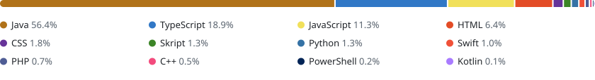

# Hey, I'm Michael 👋

**TheMCraft** · developer from Austria 🇦🇹 
I build Minecraft server networks, full-stack web apps and the occasional ESP32 gadget.

## ⚡ About me

- ⛏️ My main project is **MinerGames**, a Minecraft network: I'm one of its core developers and write Java plugins on Paper & Velocity
- 🤝 Also building **FriendNetwork**, a Discord community platform with a web app and a mobile app
- 🌐 Full-stack web: React / Next.js front ends, NestJS / Express back ends, SQL, Docker
- 📱 On the side: SwiftUI apps, a bit of Android, ESP32 firmware with companion apps
- 🔭 Right now: mostly Paper plugins and web tooling for the MinerGames team

## 🛠️ What I work on

### ⛏️ MinerGames · main project

A Minecraft network, and where most of my code goes. On the team since 2023. It started on BungeeCord and now runs on Velocity & Paper. The repos are private, so this is only the rough picture:

| Area | What I do | Stack |
|---|---|---|
| **Network core** | shared core plugin, database layer, proxy-side systems | Java 21+ · Paper API · Velocity API · HikariCP · MariaDB · Adventure |
| **Game modes** | lobby, minigames, freebuild, economy & essentials plugins | Paper API · WorldEdit · Citizens · Vault · LuckPerms · PlaceholderAPI · PacketEvents · Geyser/Floodgate · Skript |
| **Website** | the public network website | Next.js · React · TypeScript · Tailwind CSS · MySQL |
| **Team panel** | internal web app for the staff team | React · Vite · Mantine · TanStack Query · NestJS · Drizzle ORM · PostgreSQL · Yjs |
| **Tooling** | Discord bot, i18n & build scripts, CI/CD | Python · discord.py · PowerShell · Gradle · GitHub Actions · Docker |

### 🤝 FriendNetwork

A Discord community platform with a web app, REST API, bots and a mobile app. 
**Stack:** Node.js · Express · discord.js · Passport · MariaDB · React Native / Expo · Docker

### 🎓 School projects & assignments

| Project | What | Stack |
|---|---|---|
| [Echoes of the Labyrinth](https://github.com/TheMCraft/Echoes-of-the-Labyrinth) | labyrinth game for iOS | Swift · SwiftUI · SpriteKit · Core Haptics |
| [VoiceNotes](https://github.com/TheMCraft/VoiceNotes) | voice notes with speech recognition | Swift · SwiftUI · AVFoundation · Speech |
| MySmartDisplay: [iOS](https://github.com/TheMCraft/MySmartDisplay) · [Android](https://github.com/TheMCraft/MySmartDisplayAndroid) · [ESP32](https://github.com/TheMCraft/MySmartDisplay-ESP) | LED display controlled over Bluetooth LE | SwiftUI · CoreBluetooth · Kotlin · Jetpack Compose · C++ · PlatformIO |
| Tung Tung Turret: [firmware](https://github.com/TheMCraft/TungTungTurretESP) · [web](https://github.com/TheMCraft/TungTungTurretWeb) | automated ESP32-CAM Nerf turret | C++ · ESP32-CAM · PlatformIO |
| [LeviCube-Core](https://github.com/TheMCraft/LeviCube-Core) | ESP8266 firmware with Wi-Fi setup portal & web control | C++ · Arduino · PlatformIO |
| [HTLMedia](https://github.com/TheMCraft/HTLMedia) | image management & admin panel for a school media team | React · Vite · Express · MySQL |

### 🧪 Side projects

| Project | What | Stack |
|---|---|---|
| [RhythiaTracker](https://github.com/TheMCraft/RhythiaTracker) | Discord bot for the rhythm game Rhythia | Node.js · discord.js |
| [SocialLink](https://github.com/TheMCraft/SocialLink) | links Minecraft accounts to a web profile | Java · BungeeCord · PHP · MySQL |
| [Lobby](https://github.com/TheMCraft/Lobby) | Minecraft lobby plugin | Java · Spigot API · Gradle |

## 📊 Languages

<picture>
  <source media="(prefers-color-scheme: dark)" srcset="assets/languages-dark.svg">
  
</picture>

A rough split by lines of code I've added across ~1,950 commits in 37 repos (private ones included), 2023–2026. Snapshot from September 2026.

## 🧰 Tech stack

**Languages** 

**Web & back end** 

**Data & DevOps** 

**Build, apps & hardware** 

## 📈 Activity

<picture>
  <source media="(prefers-color-scheme: dark)" srcset="https://streak-stats.demolab.com/?user=TheMCraft&theme=github-dark-blue&hide_border=true">
  
</picture>

Most of my code lives in private organization repos. The public ones here are only a small slice.

